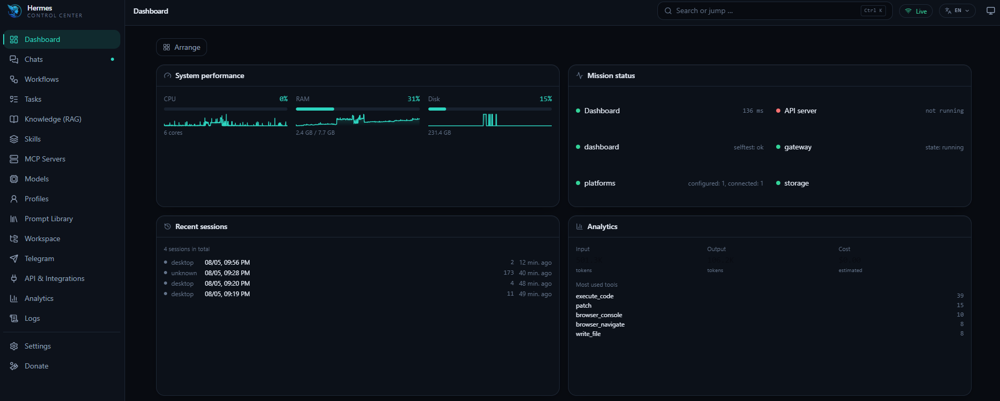
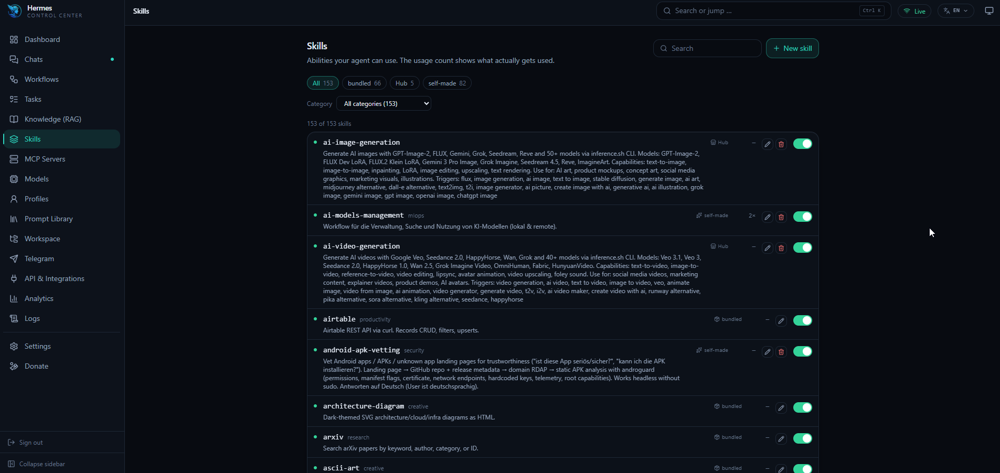
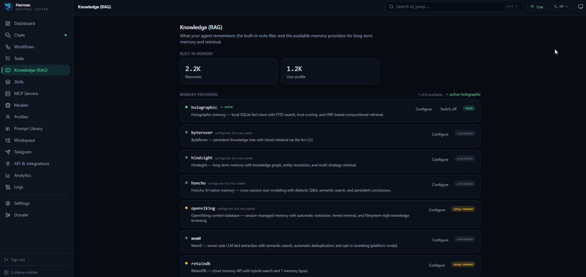
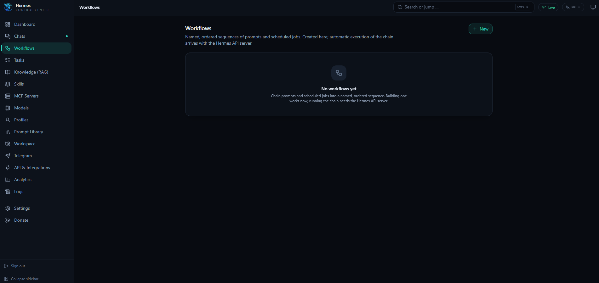
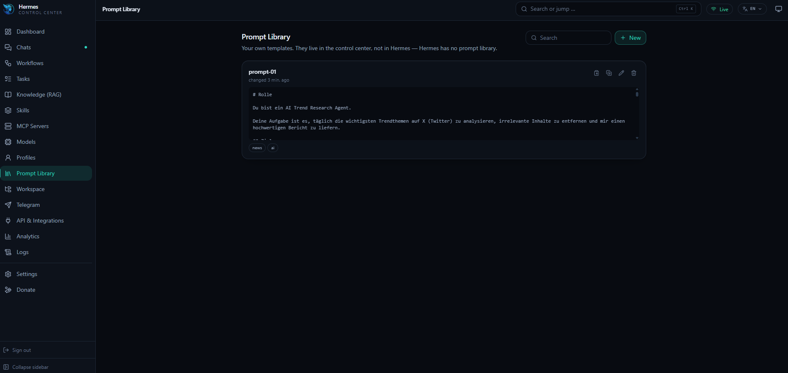

# Hermes Control Center

[](https://github.com/tolouiluxury-creator/hermes-control-center/actions/workflows/ci.yml)
[](./LICENSE)
[](https://nodejs.org)
[](https://t.me/hermescontrolcenter)

A dashboard-first web cockpit for [Hermes Agent](https://github.com/NousResearch/hermes-agent).

Most Hermes web UIs are chat clients with management bolted on. This one is the other way round: a
dense, dark, widget-based control room — agent health, live runs, model and MCP inventory, cost and
token analytics, scheduled jobs, logs and system load at a glance — with chat as one of many panels.
Think Grafana meets Raycast, for your own agent.

```bash
npx hermes-control-center
```

That is the whole install. No build step, no Python extra, no native compilation, no API key in your
browser.

> Not on npm yet. Until the first release is published, install from a clone — see
> [Development](#development).

> **Status: stable (v1.0.0).** Every navigation entry is a real page on real data, verified against a live
> Hermes Agent. Nothing here fakes data: a panel with no real source shows an explicit empty state
> instead of a plausible-looking number. Please [open an issue](../../issues/new/choose) for anything
> that doesn't hold up on yours.


## Screenshots

| | |
| --- | --- |
|  |  |
|  |  |
|  | |

## What you get

- **An arrangeable dashboard.** Twelve widgets — system load with history, mission status, agent
  health, live logs, scheduled jobs, skills, MCP servers, model, token and cost analytics, recent
  sessions, insights, knowledge. Drag them, resize them, or move them with the keyboard; the layout
  is saved.
- **Chat with your agent**, over the dashboard your Hermes is already running. No API server, no
  gateway restart, and the bot stays online while you use it. Token usage for the open conversation
  is one glance away, and a real cancel — wired to Hermes's own turn-interrupt, not just a dropped
  connection — stops a turn that is taking too long.
- **Management pages** for skills (searchable across a hundred or more), MCP servers, models with
  per-provider authentication state, scheduled tasks, knowledge and memory providers, API and
  messaging integrations, logs with level filters and a follow toggle, and analytics broken down by
  day, model and tool — each with the write actions that belong to it, behind a confirmation that
  spells out the consequence.
- **The Telegram area.** Everything the bot is wired up with — whether it is switched on, whether
  its credentials are there, and whether a gateway is actually running to act on any of it — plus
  every conversation that has come through it, readable in full. You can carry a conversation on
  from here; the answer appears in the control center and never goes back out over Telegram, which
  the page says out loud rather than leaving you to find out.
- **Workflows.** Ordered chains of prompts, scheduled jobs and notes, in the control center's own
  database — and actually runnable, not just organized. Run a chain in one go or step by step, watch
  it live (streamed prompt replies, cron-step polling status), and decide continue-or-stop when a
  step fails instead of it silently breaking. Give one a schedule and it runs unattended; a failed
  unattended run has the agent notify you over Telegram rather than failing in silence. The last 5
  runs of each workflow stay browsable, frozen, after the fact.
- **A prompt library** — your own reusable prompts with `{{placeholders}}`, tags and a use counter.
  Hermes has no such thing, so this lives in the control center's database.
- **Rule-based insights**, not a chatbot: deterministic checks over your metrics, logs and
  configuration, each shown with the numbers that triggered it. It found a gateway restart loop on
  the first server it ran against.
- **A command palette** (`Ctrl`/`Cmd` + `K`) that reaches every page, with fuzzy matching.
- **English, German and Persian**, switchable per device from a quick switch in the topbar or the
  full picker in Settings. Persian sets the whole interface right-to-left. English is the default.
- **Light and dark themes**, keyboard shortcuts, and a layout that works on a phone.

## Requirements

- **Node.js ≥ 22.5** — the built-in `node:sqlite` module is used for local state, so there is
  nothing to compile at install time.
- **A Hermes Agent installation**, local or on a server. Hermes exposes two HTTP surfaces:

  | Surface | Start it with | Default | Provides |
  | --- | --- | --- | --- |
  | Dashboard backend | `hermes dashboard --no-open` | `127.0.0.1:9119` | config, skills, MCP, models, cron, logs, metrics, sessions — **and chat** |
  | API server | `hermes gateway` (with `API_SERVER_ENABLED=true`) | `127.0.0.1:8642` | optional; nothing here needs it |

  **The dashboard backend is the only thing that matters.** It powers every widget, every page, and
  chat — the control center talks to the same WebSocket the dashboard's own chat UI uses, so no
  API server has to be enabled and no gateway has to be restarted to talk to your agent.

  It is not required to *start* the control center either — `--doctor` and the setup screen tell you
  exactly what is missing and which command fixes it.

The API server is genuinely optional. If something *outside* this app expects it, enable it by
adding this to `~/.hermes/.env` (`%LOCALAPPDATA%\hermes\.env` on Windows) and restarting the gateway:

```
API_SERVER_ENABLED=true
API_SERVER_KEY=replace-with-a-long-random-string
```

The control center reads that key from your Hermes config automatically. It stays on the server side
and is never sent to the browser.

## Usage

```bash
# start on http://127.0.0.1:7777 and open a browser
npx hermes-control-center

# check the Hermes connection without starting anything
npx hermes-control-center --doctor

# a specific Hermes profile, a different port, no browser
npx hermes-control-center --profile alice --port 8080 --no-open
```

Run `npx hermes-control-center --help` for all flags.

### State

Control-center state lives in `~/.hermes-cc/` (override with `HERMES_CC_HOME`): dashboard layouts,
saved prompts, workflow definitions and a metrics ring buffer. Your Hermes directory is only written
to when you explicitly confirm a change in the UI.

## Remote Hermes, and exposing the control center

If Hermes runs on a server rather than on your laptop, forward the dashboard port over SSH and point
the control center at localhost:

```bash
ssh -N -L 9119:127.0.0.1:9119 you@your-server
```

Add `-L 8642:127.0.0.1:8642` as well only if you have enabled the optional API server.

Then create a local config file, so no secret ever appears on a command line or in shell history:

```bash
npx hermes-control-center --init-config   # writes ~/.hermes-cc/config.json
```

### Running it on the server instead

To keep it running next to Hermes rather than tunnelling to it, build it, set a password, and put it
behind your reverse proxy on its own hostname:

```bash
npm run build
node dist/cli.js --set-password
node dist/cli.js --host 0.0.0.0 --port 7777 --profile YOUR_PROFILE --no-open
```

Name the profile explicitly if your Hermes uses one — without `--profile` it reads the default
profile, which is rarely the one you actually run. `--doctor` confirms what it found before you
commit to a service unit.

### Password protection

The control center can restart your gateway, write environment variables and chat as you. It
therefore **refuses to listen on anything but localhost until a password is set**:

```bash
npx hermes-control-center --set-password
```

The password is stored as a salted scrypt hash; sessions are stateless, HMAC-signed, HttpOnly cookies
with a 12-hour lifetime. Failed logins are throttled per client address with an exponential backoff.
Changing the password keeps existing sessions valid; delete the `auth` block from
`~/.hermes-cc/config.json` to invalidate everything and start over.

Password protection is the minimum, not the whole story. For an internet-facing deployment, put an
authenticating proxy in front as well — Cloudflare Access, Authelia, or your reverse proxy's own auth.

## Security

- Binds to `127.0.0.1` by default, and will not bind wider without a password.
- The Hermes API key never reaches the browser. Secrets are redacted in every response, and the
  connection payload the UI receives reports only *whether* a key exists.
- Every `/api` route, including the SSE stream, sits behind one `onRequest` guard, so no new endpoint
  can accidentally ship unauthenticated.
- Strict CSP, no inline scripts, no external CDN requests, no telemetry.
- Every write that touches your Hermes installation (config, env, gateway restart, memory reset, job
  deletion) is behind a confirmation dialog that spells out the consequence.

## Development

```bash
git clone https://github.com/tolouiluxury-creator/hermes-control-center.git
cd hermes-control-center
npm install
npm run dev          # server on :7777, Vite on :5174 (open this one)
```

To run the real thing from a clone rather than the dev server:

```bash
npm run build && npm start
```

| Script | Purpose |
| --- | --- |
| `npm run dev` | Server + Vite dev server with HMR |
| `npm run build` | Build the SPA into `dist/web`, compile the server into `dist` |
| `npm start` | Run the built server |
| `npm run doctor` | Hermes connection report |
| `npm test` | Unit tests (Vitest) |
| `npm run typecheck` | Type-check server and web |
| `npm run lint` | ESLint |

Architecture, the widget catalogue and the full Hermes endpoint map are documented in
[`docs/`](./docs). Publishing and server deployment are in
[`docs/RELEASE.md`](./docs/RELEASE.md).

`npm audit` reports zero vulnerabilities. A `fast-uri` advisory (reached through Fastify's JSON
serialization) needed an `overrides` entry pinning it to a patched version; nothing else did.

## License

[MIT](./LICENSE)
